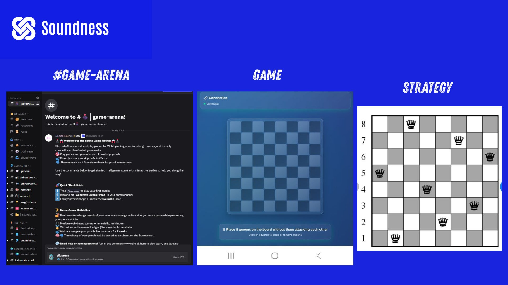
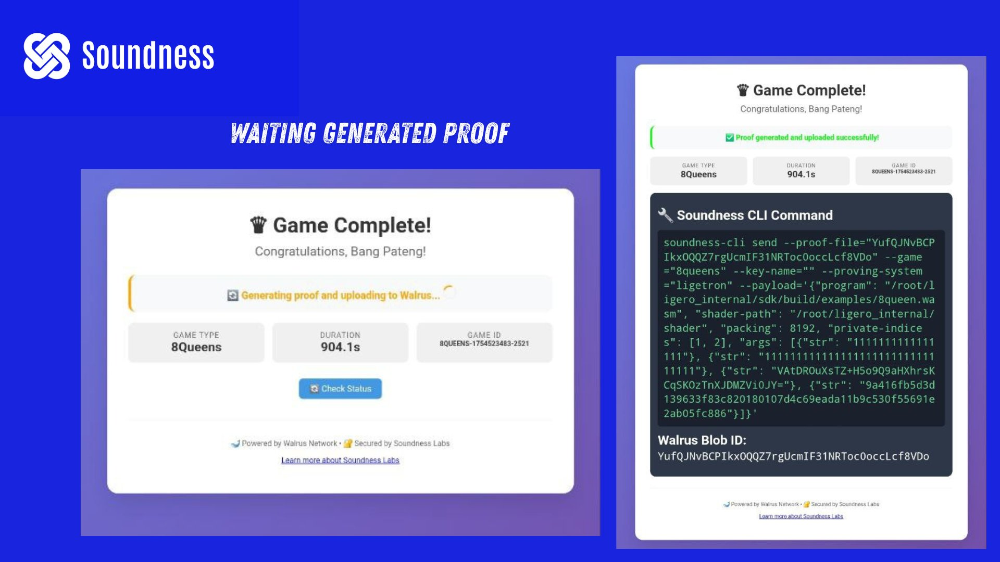
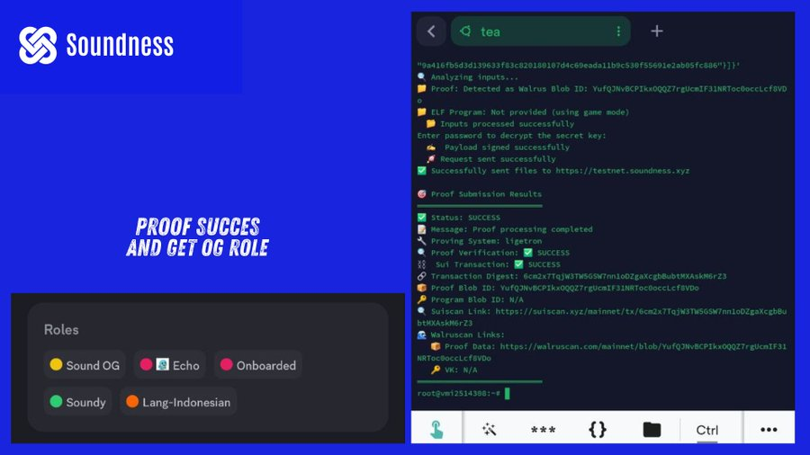

#step by step

## Install CLI

```
sudo apt update && sudo apt upgrade -y
sudo apt install openssl libssl-dev pkg-config
```

```
curl -sSL https://raw.githubusercontent.com/soundnesslabs/soundness-layer/main/soundnessup/install | bash
source ~/.bashrc
```

```
curl --proto '=https' --tlsv1.2 -sSf https://sh.rustup.rs/ | sh
source $HOME/.cargo/env
```

```
soundnessup install
soundnessup update
```

## Import Old Account mu

```
soundness-cli import-key --name my-key --mnemonic "Your Pharse"
```

## Play the Game


Jika kamu melihat server #game-arena terbuka, itu berarti giliranmu untuk bermain.

➾ Ketik /8queens
➾ Klik "Launch Game" untuk diarahkan ke situs web

Permainannya adalah teka-teki catur di mana kamu harus menempatkan 8 ratu dengan posisi yang benar.
Kamu bisa menggunakan strategi yang sudah aku berikan di gambar, atau mencari strategi lain menggunakan ChatGPT.


## Dapatkan Perintah

Setelah kamu berhasil menyelesaikan permainan, tunggu 5–20 menit hingga perintah Soundness CLI muncul, lalu salin perintah tersebut.


## Edit dan Tempel Perintah

➾ Pastikan untuk mengedit perintah: --key-name="here"
(ganti "here" dengan nama key milikmu saat pertama kali menginstal CLI contoh : my-key)

➾ Tempel perintah yang sudah diedit ke Codespace/VPS tempat CLI terinstal.

➾ Lanjutkan langkah berikutnya sampai muncul pesan sukses seperti pada gambar.

Cek Discord-mu

Setelah selesai, kamu akan melihat bahwa akun Discord-mu sudah mendapatkan role OG.

source pict : bang pateng
